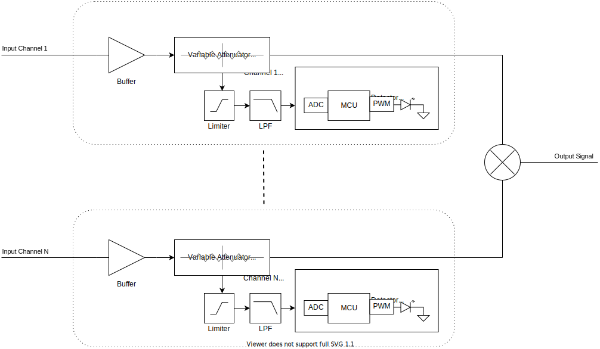
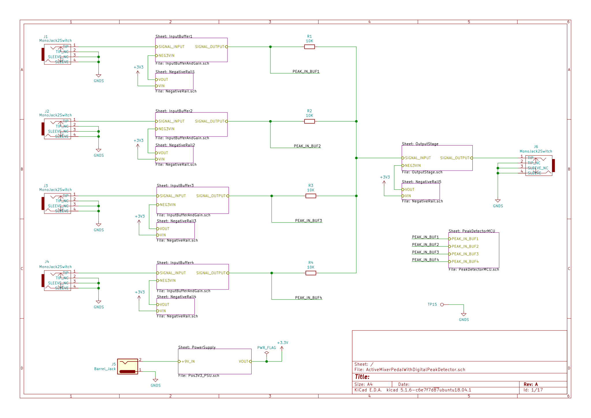
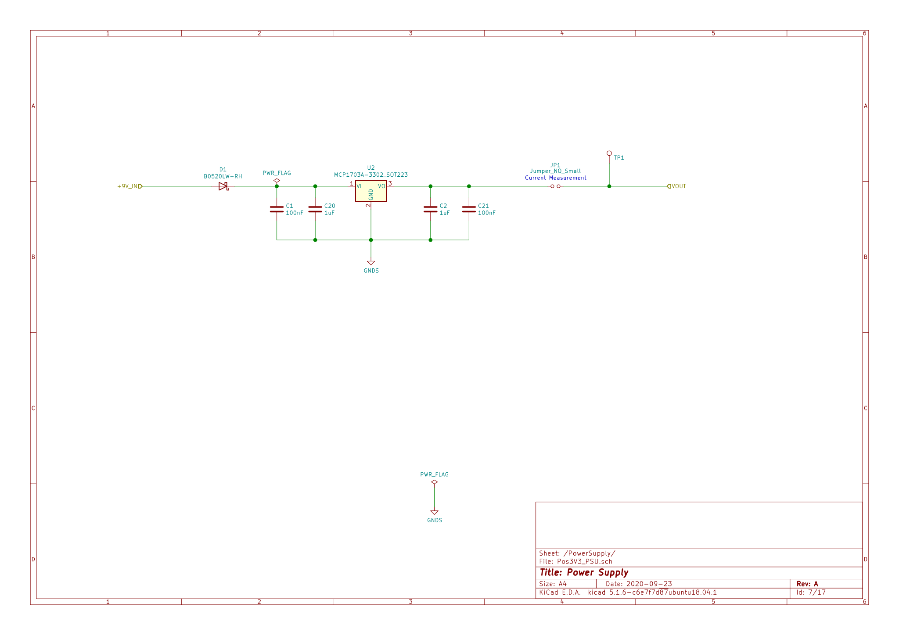
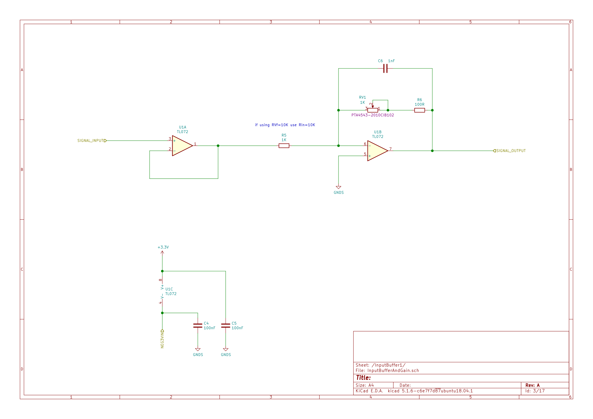
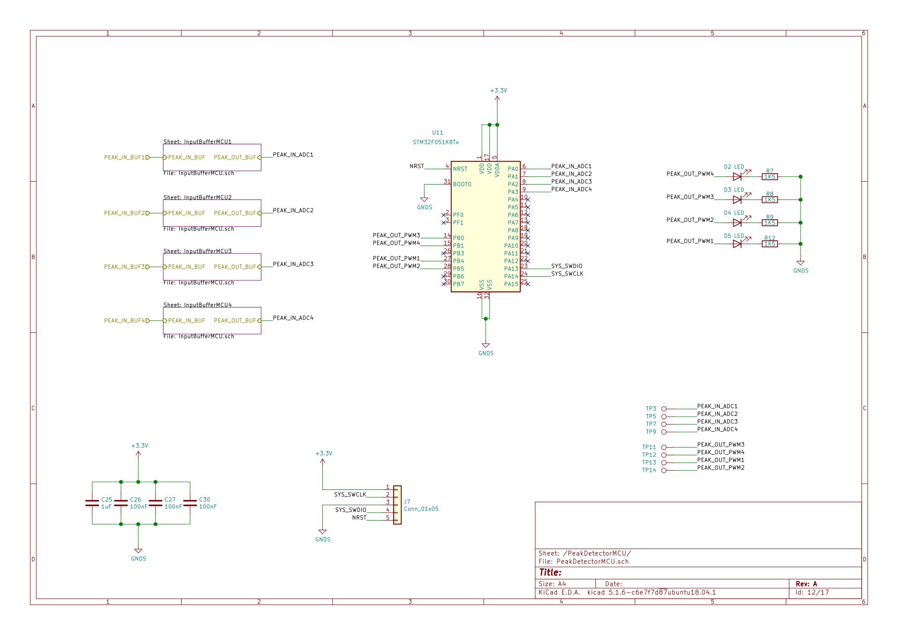
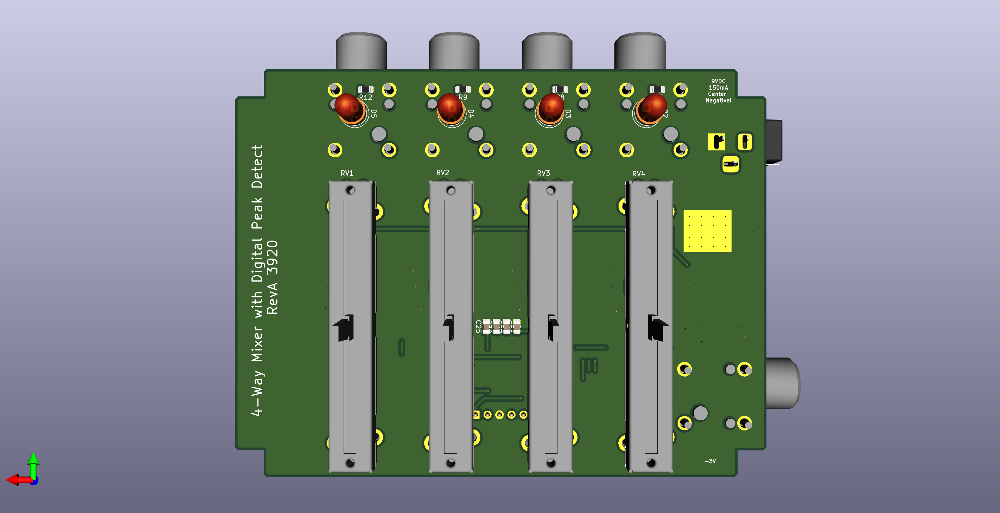
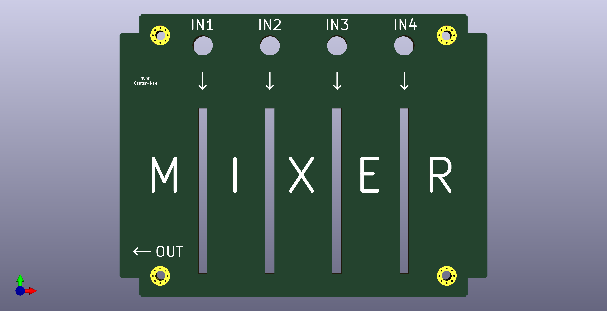
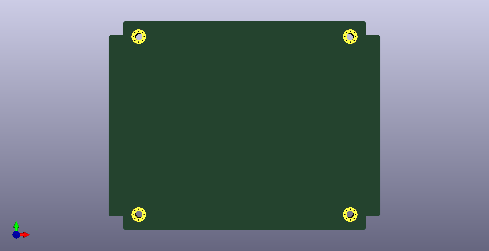

## Active 4-way mixer pedal with digital peak detector

- Analog 4->1 mixer circuit with buffered inputs and input gain control.
- Digital LED peak detector per input channel.
- Fits in a Hammond 1590BB enclosure (120mm x 95mm).

Related SW project: https://github.com/cracked-machine/DigitalPeakDetector_SW

### System Overview

### Schematic

##### Top Level

##### Power Supply block

##### Buffer/Attenuator block

##### Peak Detector block

## 3D Renderings

__PCB__

__Front Panel__

__Back Panel__

__PCB and panel profile__

